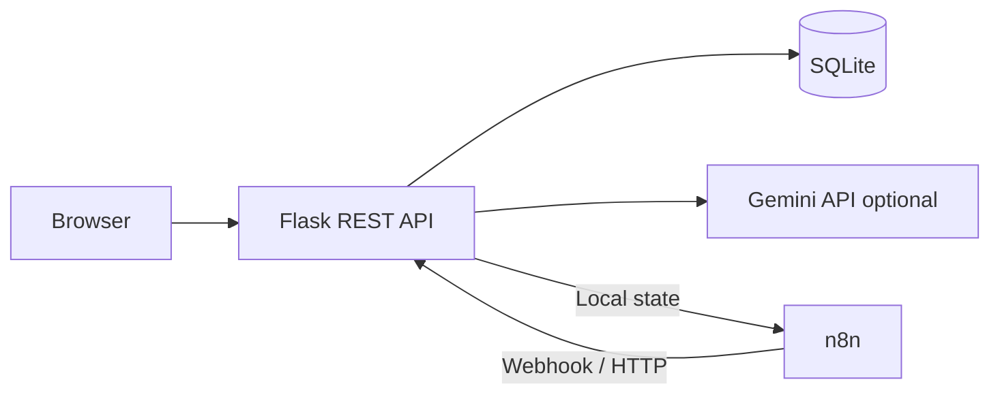
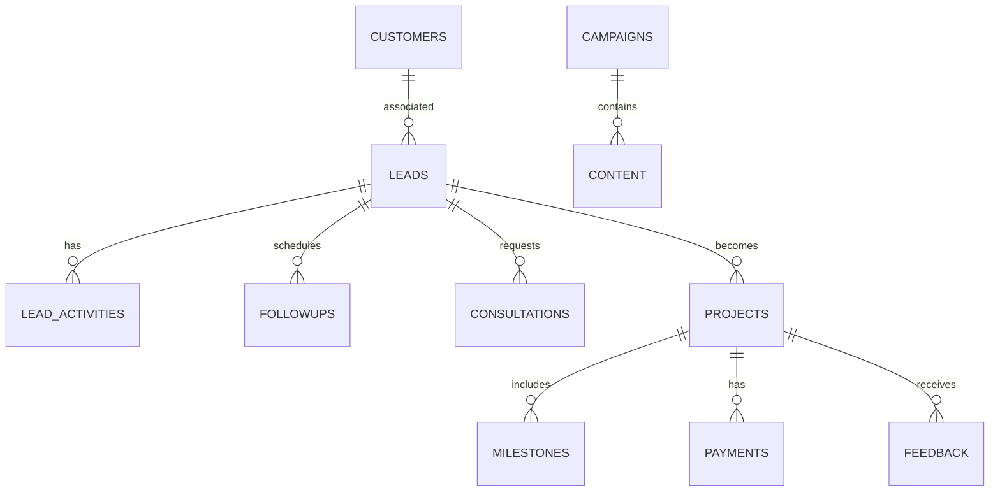
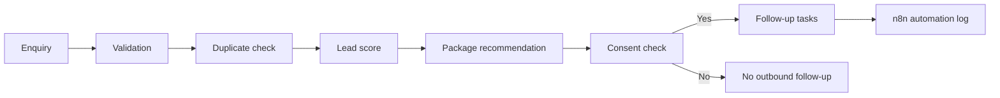

# Architecture and ERD

## System architecture

```mermaid
flowchart LR
  U[Browser] --> F[Flask REST API]
  F --> S[(SQLite)]
  F --> G[Gemini API optional]
  N[n8n] -->|Webhook / HTTP| F
  F -->|Local state| N
```

## Entity relationship

```mermaid
erDiagram
  CUSTOMERS ||--o{ LEADS : associated
  LEADS ||--o{ LEAD_ACTIVITIES : has
  LEADS ||--o{ FOLLOWUPS : schedules
  LEADS ||--o{ CONSULTATIONS : requests
  LEADS ||--o{ PROJECTS : becomes
  PROJECTS ||--o{ MILESTONES : includes
  PROJECTS ||--o{ PAYMENTS : has
  PROJECTS ||--o{ FEEDBACK : receives
  CAMPAIGNS ||--o{ CONTENT : contains
```

## Customer journey

```mermaid
flowchart LR
  E[Enquiry] --> V[Validation]
  V --> D[Duplicate check]
  D --> S[Lead score]
  S --> P[Package recommendation]
  P --> C[Consent check]
  C -->|Yes| F[Follow-up tasks]
  C -->|No| H[No outbound follow-up]
  F --> A[n8n automation log]
```
